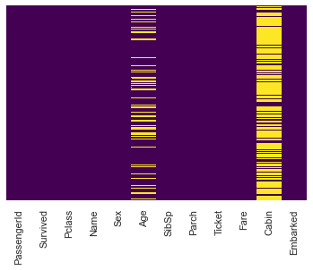
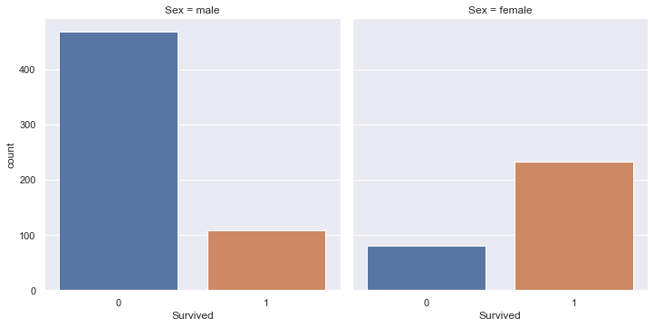
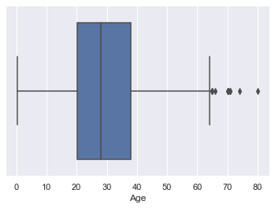
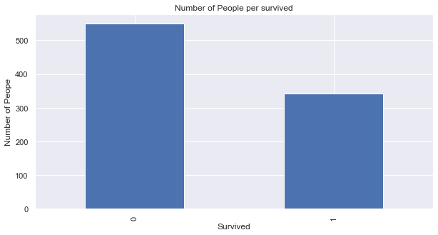
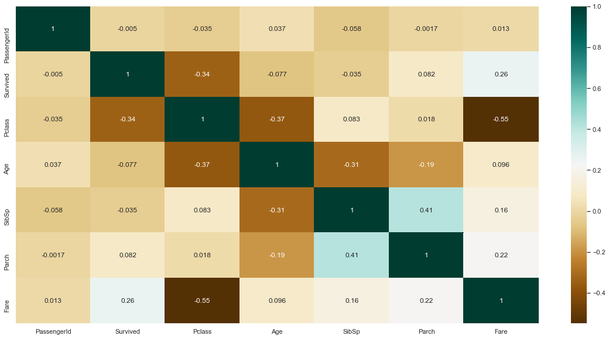
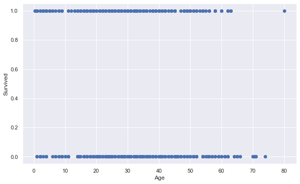
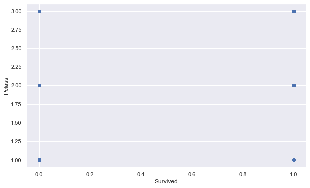

# Beispiel mit Python 

## Imports


```python
import time
start = time.time()
## imports
# Importing required libraries for EDA
import pandas as pd
import numpy as np
import seaborn as sns # visualisation
import matplotlib.pyplot as plt # visualisation
#matplotlib inline 
sns.set(color_codes=True)

# additonal libraries
from pathlib import Path
```

## Einfaches Beispiel

### Daten einlesen und anzeigen


```python
path = "train.csv"
train=pd.read_csv(path)
print(train.head())
```

       PassengerId  Survived  Pclass  \
    0            1         0       3   
    1            2         1       1   
    2            3         1       3   
    3            4         1       1   
    4            5         0       3   
    
                                                    Name     Sex   Age  SibSp  \
    0                            Braund, Mr. Owen Harris    male  22.0      1   
    1  Cumings, Mrs. John Bradley (Florence Briggs Th...  female  38.0      1   
    2                             Heikkinen, Miss. Laina  female  26.0      0   
    3       Futrelle, Mrs. Jacques Heath (Lily May Peel)  female  35.0      1   
    4                           Allen, Mr. William Henry    male  35.0      0   
    
       Parch            Ticket     Fare Cabin Embarked  
    0      0         A/5 21171   7.2500   NaN        S  
    1      0          PC 17599  71.2833   C85        C  
    2      0  STON/O2. 3101282   7.9250   NaN        S  
    3      0            113803  53.1000  C123        S  
    4      0            373450   8.0500   NaN        S  
    

### einfache Plots 


```python
sns.heatmap(train.isnull(),yticklabels=False,cbar=False,cmap='viridis')
sns.catplot(x='Survived',col='Sex',kind='count',data=train) # factorplot -> catplot
plt.show()
```


    

    


    

    


### Datensatz analysieren


```python
# Datentypen analysieren 
train.dtypes

# Auf Duplikate prüfen
duplicate_rows_df = train[train.duplicated()]

# Folgende Ausgabe sollte die Anzahl der Duplikate in unserem Datensatz anzeigen.
# In unserem Fall 0
print("number of duplicate rows: ", duplicate_rows_df.shape, "\n")

# Auf null-Values prüfen 
print(train.count())
print("\n")
print(train.isnull().sum())
```

    number of duplicate rows:  (0, 12) 
    
    PassengerId    891
    Survived       891
    Pclass         891
    Name           891
    Sex            891
    Age            714
    SibSp          891
    Parch          891
    Ticket         891
    Fare           891
    Cabin          204
    Embarked       889
    dtype: int64
    
    
    PassengerId      0
    Survived         0
    Pclass           0
    Name             0
    Sex              0
    Age            177
    SibSp            0
    Parch            0
    Ticket           0
    Fare             0
    Cabin          687
    Embarked         2
    dtype: int64
    

### Boxplots erstellen


```python
sns.boxplot(x=train['Age'])
```


    <AxesSubplot:xlabel='Age'>


    

    


### Kennwerte berechnen 


```python
# Interquartilsdistanz
Q1 = train.quantile(0.25)
Q3 = train.quantile(0.75)
IQR = Q3 - Q1
print(IQR)

# Mittelwerte
train.mean()
```

    PassengerId    445.0000
    Survived         1.0000
    Pclass           1.0000
    Age             17.8750
    SibSp            1.0000
    Parch            0.0000
    Fare            23.0896
    dtype: float64
    


    PassengerId    446.000000
    Survived         0.383838
    Pclass           2.308642
    Age             29.699118
    SibSp            0.523008
    Parch            0.381594
    Fare            32.204208
    dtype: float64


### verschiedene Plots


```python
# Plotting histogram 
# Plotting a Histogram
train.Survived.value_counts().nlargest(40).plot(kind='bar', figsize=(10,5))
plt.title("Number of People per survived")
plt.ylabel('Number of Peope')
plt.xlabel('Survived');

# Plotting heat maps
# Finding the relations between the variables.
plt.figure(figsize=(20,10))
c= train.corr()
sns.heatmap(c,cmap="BrBG",annot=True)
c

# Plotting a scatter plot
fig, ax = plt.subplots(figsize=(10,6))
ax.scatter(train['Age'], train['Survived'])
ax.set_xlabel('Age')
ax.set_ylabel('Survived')
plt.show()

# Plotting a scatter plot
fig, ax = plt.subplots(figsize=(10,6))
ax.scatter(train['Survived'], train['Pclass'])
ax.set_xlabel('Survived')
ax.set_ylabel('Pclass')
plt.show()
```


    

    


    

    


    

    


    

    


```python
ende = time.time()
print('{:5.3f}s'.format(ende-start))
```

    15.984s
    
