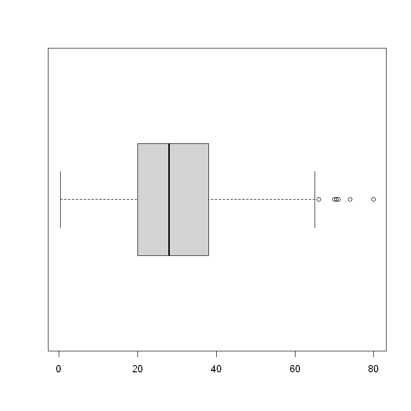
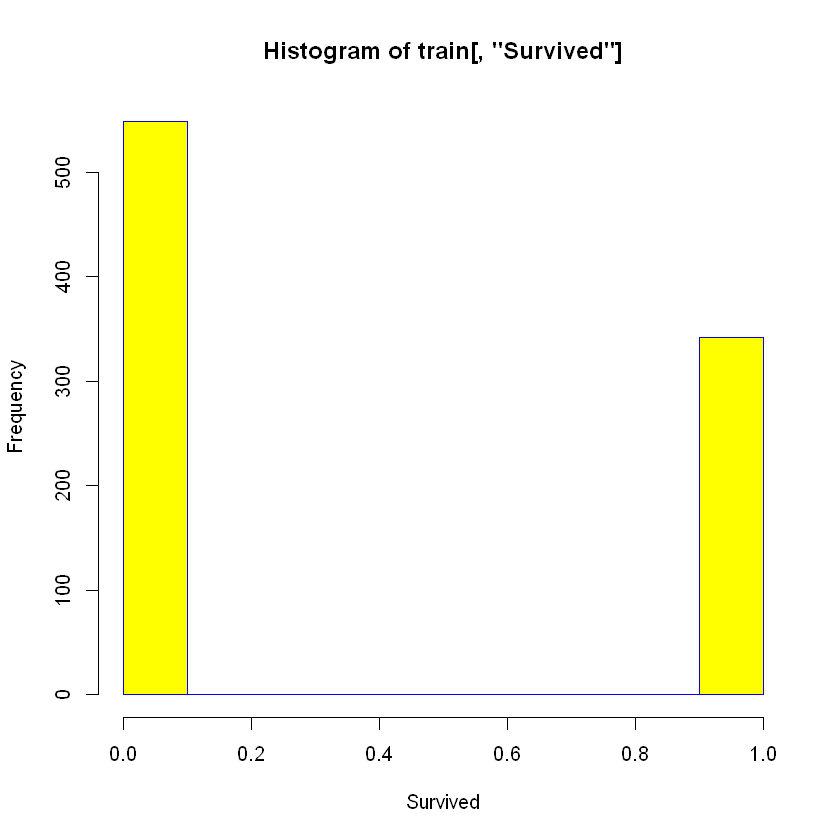
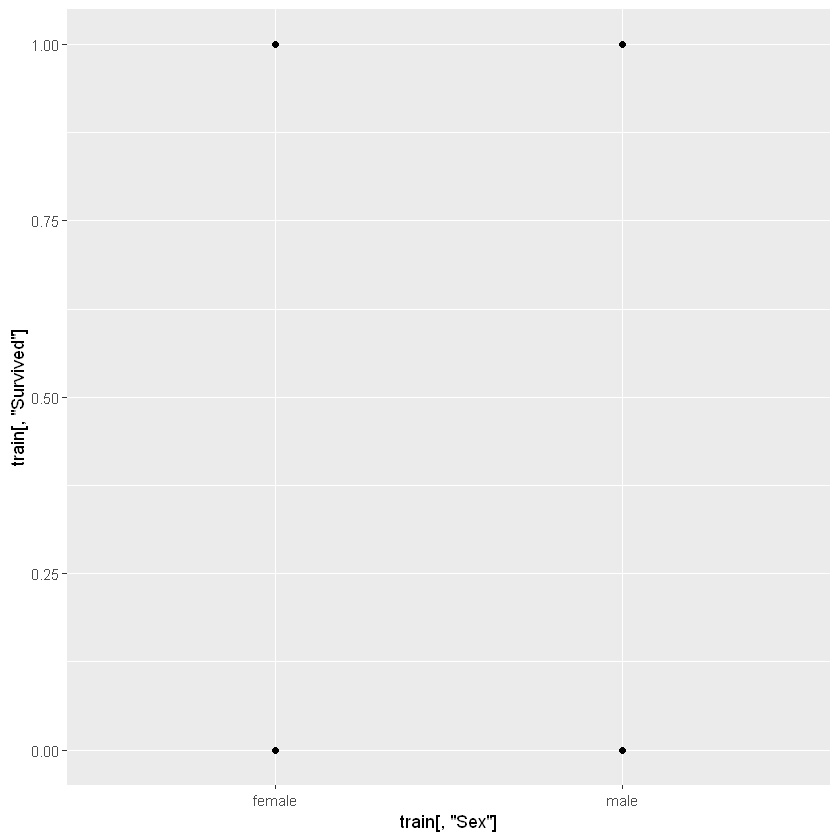
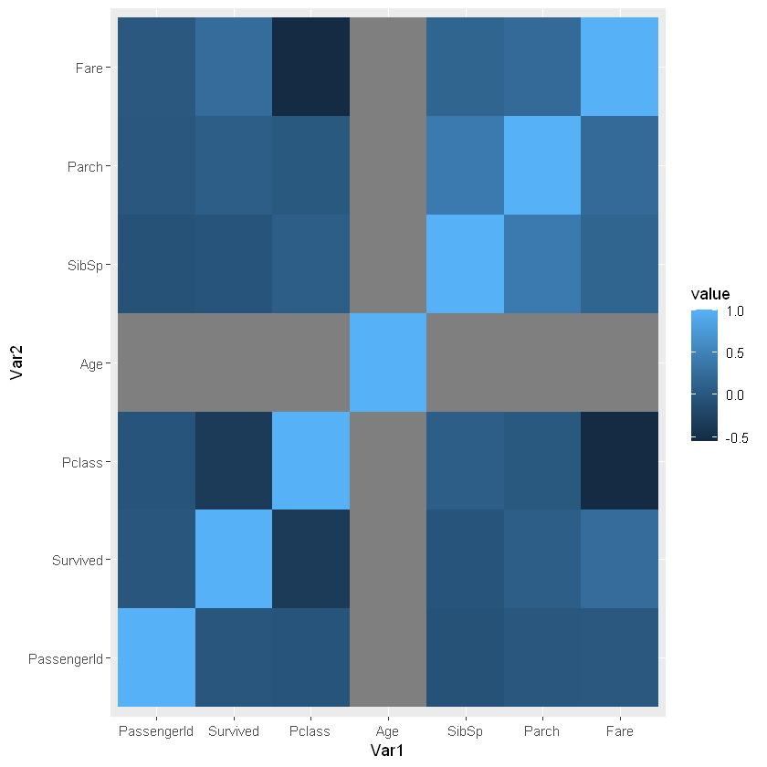

```R
start_time <- Sys.time()

library(ggplot2)
library(reshape2)

path = "train.csv"
train=read.csv(path)
head(train)
#train = as.matrix(train)

# heatmap(as.matrix(train))
boxplot(train[,'Age'], horizontal=TRUE)

hist(train[,'Survived'],xlab = "Survived",col = "yellow",border = "blue")

ggplot(train, aes(x=train[,'Sex'], y=train[,'Survived'])) + geom_point()

cormat <- round(cor(train[sapply(train, is.numeric)]),2)
melted_cormat <- melt(cormat)
ggplot(data = melted_cormat, aes(x=Var1, y=Var2, fill=value)) + 
  geom_tile()
```


<table>
<caption>A data.frame: 6 × 12</caption>
<thead>
	<tr><th></th><th scope=col>PassengerId</th><th scope=col>Survived</th><th scope=col>Pclass</th><th scope=col>Name</th><th scope=col>Sex</th><th scope=col>Age</th><th scope=col>SibSp</th><th scope=col>Parch</th><th scope=col>Ticket</th><th scope=col>Fare</th><th scope=col>Cabin</th><th scope=col>Embarked</th></tr>
	<tr><th></th><th scope=col>&lt;int&gt;</th><th scope=col>&lt;int&gt;</th><th scope=col>&lt;int&gt;</th><th scope=col>&lt;chr&gt;</th><th scope=col>&lt;chr&gt;</th><th scope=col>&lt;dbl&gt;</th><th scope=col>&lt;int&gt;</th><th scope=col>&lt;int&gt;</th><th scope=col>&lt;chr&gt;</th><th scope=col>&lt;dbl&gt;</th><th scope=col>&lt;chr&gt;</th><th scope=col>&lt;chr&gt;</th></tr>
</thead>
<tbody>
	<tr><th scope=row>1</th><td>1</td><td>0</td><td>3</td><td>Braund, Mr. Owen Harris                            </td><td>male  </td><td>22</td><td>1</td><td>0</td><td>A/5 21171       </td><td> 7.2500</td><td>    </td><td>S</td></tr>
	<tr><th scope=row>2</th><td>2</td><td>1</td><td>1</td><td>Cumings, Mrs. John Bradley (Florence Briggs Thayer)</td><td>female</td><td>38</td><td>1</td><td>0</td><td>PC 17599        </td><td>71.2833</td><td>C85 </td><td>C</td></tr>
	<tr><th scope=row>3</th><td>3</td><td>1</td><td>3</td><td>Heikkinen, Miss. Laina                             </td><td>female</td><td>26</td><td>0</td><td>0</td><td>STON/O2. 3101282</td><td> 7.9250</td><td>    </td><td>S</td></tr>
	<tr><th scope=row>4</th><td>4</td><td>1</td><td>1</td><td>Futrelle, Mrs. Jacques Heath (Lily May Peel)       </td><td>female</td><td>35</td><td>1</td><td>0</td><td>113803          </td><td>53.1000</td><td>C123</td><td>S</td></tr>
	<tr><th scope=row>5</th><td>5</td><td>0</td><td>3</td><td>Allen, Mr. William Henry                           </td><td>male  </td><td>35</td><td>0</td><td>0</td><td>373450          </td><td> 8.0500</td><td>    </td><td>S</td></tr>
	<tr><th scope=row>6</th><td>6</td><td>0</td><td>3</td><td>Moran, Mr. James                                   </td><td>male  </td><td>NA</td><td>0</td><td>0</td><td>330877          </td><td> 8.4583</td><td>    </td><td>Q</td></tr>
</tbody>
</table>


    

    


    

    


    

    


    

    


```R
end_time <- Sys.time()
end_time - start_time
```


    Time difference of 3.018706 secs

